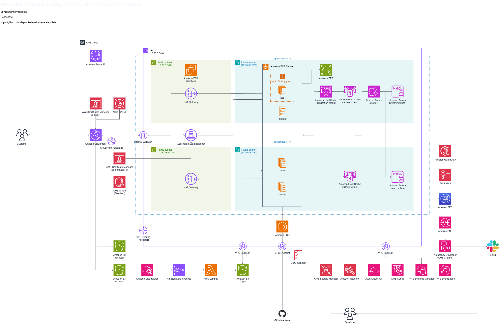

# terraform-web-template

このテンプレートは、Amazon Web ServicesとTerraformによる、Web3レイヤ構成のWebアプリケーション向けのリソースを構築するために使用するものです。AWS Fargateを用いたコンテナを用いてWebアプリケーションを構築することを想定しています。

また、標準的な3ステージ構成としており、1つのAWSアカウントに対して、1つの環境を構築することを前提としています。

## ディレクトリ構成

このテンプレートは以下のディレクトリで構成されています。

### `/audit`

Web3レイヤ構成のWebアプリケーション向けのAWSリソースのうち、セキュリティ & コンプライアンス系のリソースと、それらに関連するリソースを、集約して実装しています。

なお、1つのAWSアカウントに対して、1つの`/audit`ディレクトリ内で実装しているセキュリティ & コンプライアンス系のAWSリソース等を構築することを想定して実装しています。

### `/production`

Web3レイヤ構成のWebアプリケーション向けの本番環境を構築するためのAWSリソースを実装しています。

### `/staging`

Web3レイヤ構成のWebアプリケーション向けのステージング環境を構築するためのAWSリソースを実装しています。

### `/develop`

Web3レイヤ構成のWebアプリケーション向けの開発環境を構築するためのAWSリソースを実装しています。

## Terraform & 各種Provider & PythonのruntimeのVersion

このテンプレートで使用している、Terraform、各種Provider及びPythonのruntimeのVersionは、以下の通りです。

- [hashicorp/aws Terraform Registry](https://registry.terraform.io/providers/hashicorp/aws/latest)
- [hashicorp/awscc Terraform Registry](https://registry.terraform.io/providers/hashicorp/awscc/latest)

### PythonのVersionについて

Pythonのバージョンについては、macOS上でHomebrewでパッケージを管理している場合は、定期的に`brew outdated`コマンド実行して更新状況を能動的に確認してください。

### Terraformや各種ProviderのVersion

| Resources                  | Version |
| :------------------------- | ------: |
| Terraform                  | 1.15.7  |
| AWS Provider               | 6.52.0  |
| AWS Cloud Control Provider | 1.90.0  |

### AWS Lambda関数に使用しているPythonのruntimeのVersion

| Resources                  | Version |
| :------------------------- | ------: |
| Python                     | 3.14    |

## 構築されるAWSリソースの数

このテンプレートを実行することにより構築されるAWSリソースの数は、以下の表の通りです。

| Environmtnt | Resource | Notice           |
| :---------- | -------: | :--------------- |
| develop     |      570 | N/A              |
| staging     |      570 | N/A              |
| production  |      570 | N/A              |
| audit       |      135 | Each AWS account |

## 環境構築をする際の注意事項

このテンプレートをベースラインとして環境構築をする際の注意事項は、以下の通りです。

### コードを修正する際の注意点

このテンプレートを格納しているGitHubリポジトリでは、GitHubユーザーに対してGPGキーによる認証を必須としています。この認証設定を有効にしていない場合はコミットやPull Requestの作成等を行うことができません。GPGキーによる認証を有効化する方法については、以下のGitHubドキュメントを参考にしてください。

[新しいGPGキーを生成する - GitHubドキュメント](https://docs.github.com/ja/authentication/managing-commit-signature-verification/generating-a-new-gpg-key)

### Terraformコマンドを実行する際の注意点

- Terraformコマンドを実行する前に、各ディレクトリの`terraform.tfvars.sample`に記載されている内容に従って、`terraform.tfvars`を実装してください。このテンプレートでは、サンプルとして、GitHubリモートリポジトリ上での管理対象としない代表的な値のみを実装しています。利用方法に応じて適宜修正をしてください。
- `base_locals.tf`の`# project info`に設定している、`project`、`author`、`email`の値を修正してください。

### 複数のプラットフォームでTerraformコマンドを実行する際の注意点

Terraformや各種Providerのバージョンのアップデートを行なうため、`terraform init -reconfigure`コマンドや`terraform init -upgrade`コマンドを実行する際に、macOSやWindowsなどの複数のプラットフォーム間で`.terraform.lock.hcl`に含まれるProviderのチェックサムの値がずれてしまうことを防止する目的で、`terraform plan`コマンドを実行する前に、ターミナル上で必ず、以下のコマンドを実行してください。

```bash
terraform providers lock \
  -platform=windows_amd64 \
  -platform=darwin_amd64 \
  -platform=linux_amd64  \
  -platform=darwin_arm64 \
  -platform=linux_arm64
```

- 出典: [複数のプラットフォームで terraform initする際の注意点](https://dev.classmethod.jp/articles/multiplatform-terraform-init-lock/)

## 環境構築準備手順

環境構築準備手順は以下の通りです。(macOSのTerminal上でTerraformコマンドを実行することを前提としています)

### プロファイルの設定

環境構築に利用するAWSアカウントのプロファイルの情報を、`~/.aws/config`と`~/.aws/credentials`に設定します。

#### `~/.aws/config`

```bash:~/.aws/config
[profile terraform-web-template]
region = ap-northeast-1
output = json
mfa_serial=arn:aws:iam::{aws-account}:mfa/{mfa-device-name}
```

- {mfa-device-name}には、IAMコンソールのご自身のIAMユーザーの「多要素認証(MFA)」セクションに表示されている識別子の仮装MFAデバイス名を設定してください。

#### `~/.aws/credentials`

```bash:~/.aws/credentials
[terraform-web-template]
aws_access_key_id = ********************
aws_secret_access_key = ********************
```

なお、Terraformコマンド実行時に利用するクレデンシャル情報の管理については、`aws-vault`の利用もご検討ください。

- [aws-vaultの使い方と仕組み](https://qiita.com/takuzo8679/items/6727f46b0aaf6df0a864)

### Terraformコマンドを実行する際に必要な事前準備

Terraformコマンドを実行する前に、AWS CLIやTerraform CLIなどの必要なツールをインストールしてください。また、`terraform.tf`で実装している`terraform.tfstate`ファイルはS3バックエンドで保管するという設定にしているため、事前に各環境のAWSアカウントに紐づくAWSマネージメントコンソールの、Amazon S3コンソール内で、

```hcl:terraform.tf
backend "s3" {
  bucket  = "example-profile-name"
  key     = "key/example-environment.terraform.tfstate"
  region  = "ap-northeast-1"
  profile = "example-profile-name"
}
```

に指定されている`bucket`ディレクティブと同じ名称のS3バケットを作成します。さらに、作成したS3バケットには、`key`プレフィックスを作成してください。Terraformコマンドの実行時には、作成した`key`プレフィックス内に`example-environment.terraform.tfstate`ファイルが作成されます。

> 注意: `audit/terraform.tf`のバックエンド設定では、Terraformの`data`や`output`を使って`bucket`名を動的に解決できません。`terraform init`コマンド実行時に`-backend-config="bucket=..."`引数を用いて、明示的にS3バケット名を指定してください。

バックエンド設定を動的に扱う例:

```bash
terraform init \
  -backend-config="bucket=v-terraform-web-template-aud-$(aws sts get-caller-identity --profile terraform-template --query Account --output text)" \
  -backend-config="region=ap-northeast-1" \
  -backend-config="profile=terraform-template" \
  -backend-config="key=state/audit.terraform.tfstate"
```

### 踏み台サーバー用EC2インスタンスのKey Pairの作成

`terraform.tfvars`に設定する、踏み台サーバー用のEC2インスタンスのKey Pairの作成を行なってください。暗号化スイートは`ed25519`で固定します。

```bash
ssh-keygen -t ed25519 -f ~/.ssh/id_ed25519_terraform-web-template -C "Key Pair for terraform-web-template"
```

なお、公開鍵のみを`terraform.tfvars`に設定します。秘密鍵の管理は独自でお願いいたします。

### 親ドメインへのDNSのNSレコード追加方法

親ドメインに対して、発行されたDNSのNSレコードを追加する際は、Amazon Route 53のNSレコード発行のタイミングで、ターミナルより以下のコマンドを実行し、親ドメインへの追加をお願いします。`{env}`には、必要に応じて環境名を代入してください。

```bash
dig +noall +answer {env}.app.example.org. ns
```

## インフラ構成図

このテンプレートで構築が可能なアーキテクチャのインフラ構成図は以下の通りです。

### 本番環境


### ステージング環境



### 開発環境


## コスト

本テンプレートのすべての環境を構築した場合のコスト内訳は、以下のドキュメントを参照してください。

- [AWS Cost Estimation for terraform-web-template](./aws-cost-estimation.md)

## リリース履歴

このテンプレートのリリース履歴は、[Releases](https://github.com/vlayusuke/terraform-web-template/releases)を参照してください。

## ライセンス

このテンプレートは、GPL3のもとでライセンスされています。詳細は、[LICENSE](./LICENSE)を参照してください。
